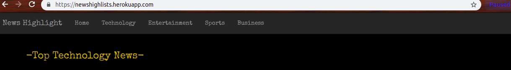
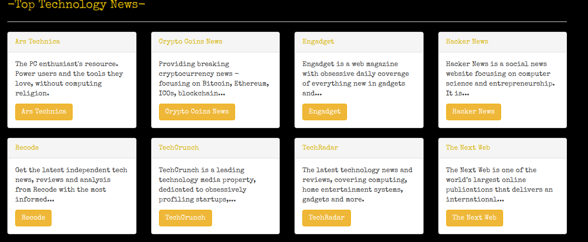
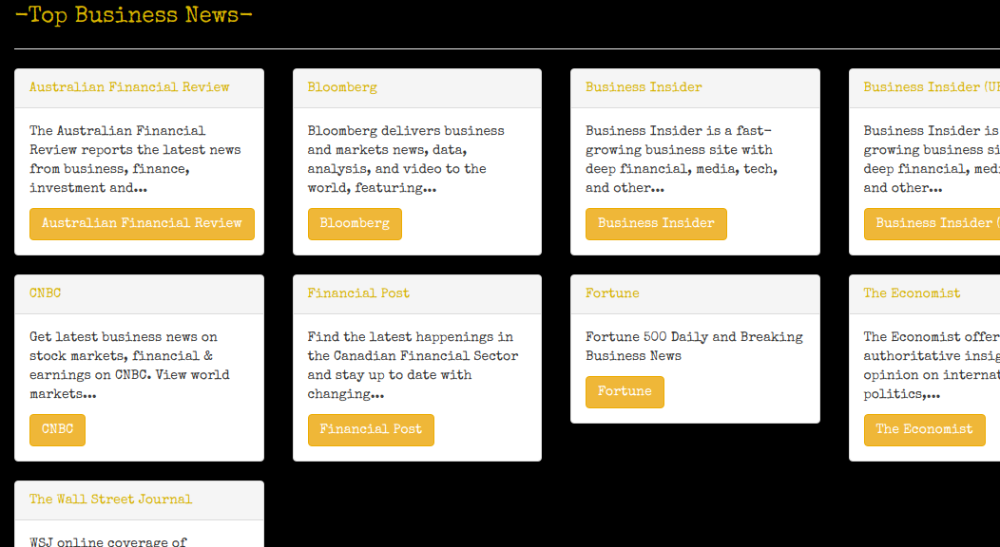

# News Highlight

## Description
An application that list and preview news articles from various sources.
 
### A nav bar that directs one to any news of their interest


### Tech news


### Business News


### Entertainment news


## Link to deployed site
https://newshighlists.herokuapp.com/

## Table of content
1. [Description](#description)
2. [Setup and installations](#setup-and-installations)
3. [Deployment](#deployment)
4. [Contributing](#contributing)
5. [Bugs](#bugs)
6. [Licensing](#license)


## Setup and installations

#### Prerequisites
1. Python 3.6
2. Pip
3. virtualenv


## Technologies Used
* Python 3.6.5
* Flask Framework
* HTML/CSS
* JavaScript

#### Clone the Repo and checkout into the project folder.

#### Setting up environment variables
Create a file to start the application. `touch start.sh`
Inside the start file  input the environment variables and start command below.
```
export NEWS_API_KEY=<Get an API KEY from newsapi.com >

python3.6 manage.py server

```

#### Create and activate the virtual environment
```bash
python3.6 -m virtualenv env
```

```bash
source env/bin/activate
```

#### Install dependencies
While in the activated virtual environment, install dependencies needed to run the application.
```bash
(env)$ pip install -r requirements.txt
```

#### Run the app
While in the activated virtual environment export environment variables and run the app with the commands below.

```bash
(env)$ export NEWS_API_KEY=<Your api key>
(env)$ export SECRET_KEY=<Your secret key>
(env)$ python3.6  manage.py server
```
Open [localhost:5000](http://127.0.0.1:5000/)

## Contributing
Feel free to contribute to this repository to make pull requests.

## [LICENSE](LICENSE)
This project is licensed under the MIT License.

Copyright (c)2019 [Risper Akinyi]
